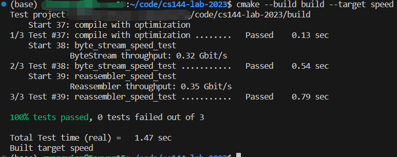

My Learning Process for CS 144 Lab 2023 Spring
==============================

- Finished lab 0
- Finished lab 1
- Finished lab 2
- Finished lab 3
- Finished lab 4
- Finished lab 5
- Finished self-test part of lab 6 (chat and file transfer)
- Not interested in lab 7

Basically completed the CS 144 Lab (2023 Spring) on my own.

Result of speed test is just so so:

  

Fork from [Stanford CS 144 Networking Lab](https://github.com/CS144/minnow)
==============================

These labs are open to the public under the (friendly) request that to
preserve their value as a teaching tool, solutions not be posted
publicly by anybody.

Website: https://cs144.stanford.edu

To set up the build system: `cmake -S . -B build`

To compile: `cmake --build build`

To run tests: `cmake --build build --target test`

To run speed benchmarks: `cmake --build build --target speed`

To run clang-tidy (which suggests improvements): `cmake --build build --target tidy`

To format code: `cmake --build build --target format`